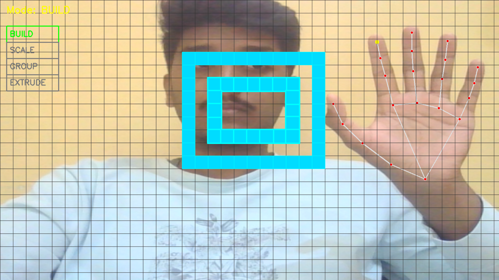
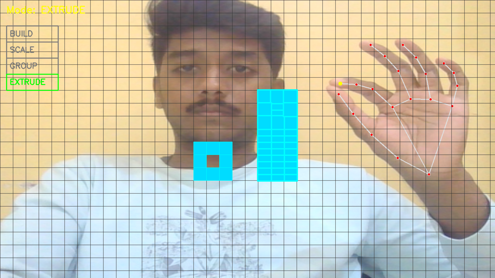
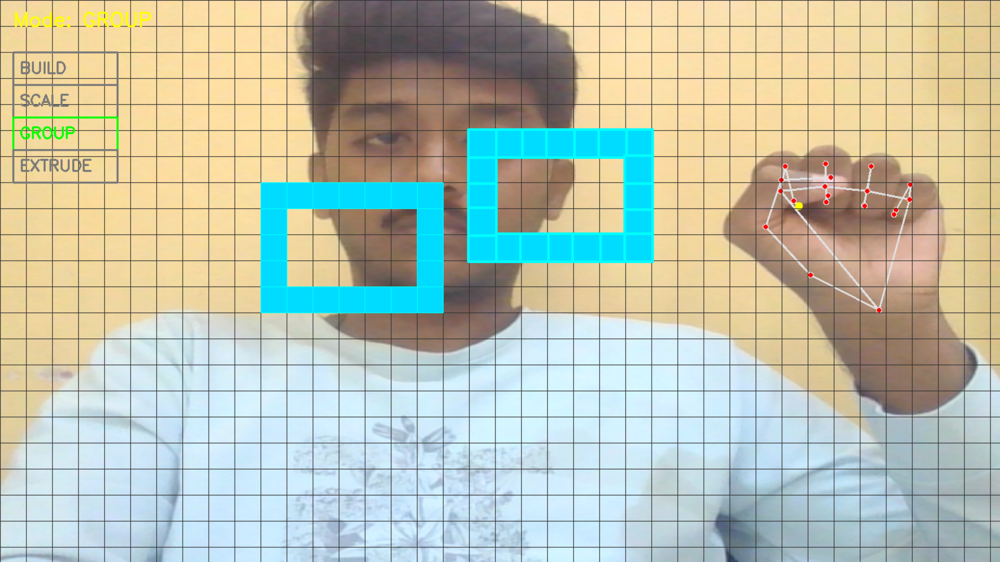
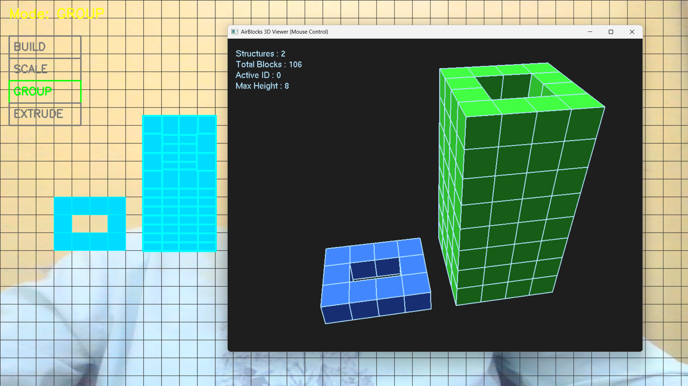

# AirBlocks  
## Gesture-Based 3D Spatial Construction System

**Design in the air. Build in space.**

---

## Introduction

**AirBlocks** is a gesture-driven 3D spatial construction system that allows users to design, manipulate, and visualize block-based structures using natural hand gestures.  
It combines **Computer Vision**, **Human–Computer Interaction (HCI)**, and **3D Graphics** to explore next-generation spatial design workflows.

The project emphasizes **explicit interaction modes**, **real-time feedback**, and a **clean separation between interaction and visualization**.

---

## Key Features

- Gesture-based construction using pinch, fist, and vertical hand motion  
- Explicit structure selection using **GROUP mode**  
- Blueprint-based grid snapping for precise layout  
- Extrusion-based height control  
- Undo / Redo support  
- Dedicated real-time **3D OpenGL viewer**  
- Smooth camera controls with auto-fit and refocus  
- CAD-style solid + wireframe visualization  
- Live scene statistics HUD  

---

## Screenshots

### BUILD Mode – Blueprint Construction


### EXTRUDE Mode – Height Manipulation


### GROUP Mode – Structure Selection & Movement


### 3D Viewer – OpenGL Visualization


---

## System Architecture

Camera Input  
→ Gesture Editor (OpenCV + MediaPipe)  
→ Scene Export (JSON)  
→ 3D Viewer (OpenGL)

The editor handles interaction and construction.  
The viewer handles visualization only.

---

## Technology Stack

**Editor**
- Python
- OpenCV
- MediaPipe Hands

**Viewer**
- PyOpenGL
- GLUT

**Data**
- JSON-based scene persistence

---

## Project Structure

```
AirBlocks/
├── phase6_1_final_selection.py
├── run_airblocks.py
├── data/
├── phase7_viewer/
├── utils/
├── screenshots/
├── requirements.txt
└── README.md
```

---

## Installation

```bash
pip install -r requirements.txt
```

---

## Running AirBlocks

```bash
python run_airblocks.py
```

---

## Controls

**Editor**
- Pinch + hold → Build
- Pinch (GROUP) → Select
- Fist → Move
- Pinch + vertical → Extrude
- Ctrl + Z / Ctrl + Y → Undo / Redo

**Viewer**
- Left mouse → Rotate
- Right mouse / Scroll → Zoom
- F → Refocus

---

## Future Scope

- AI-assisted construction
- Web-based version
- AR / VR support

---

## Author

**Taha Shaikh**  
B.Tech – Artificial Intelligence & Data Science

---

## License

Academic & educational use only.
